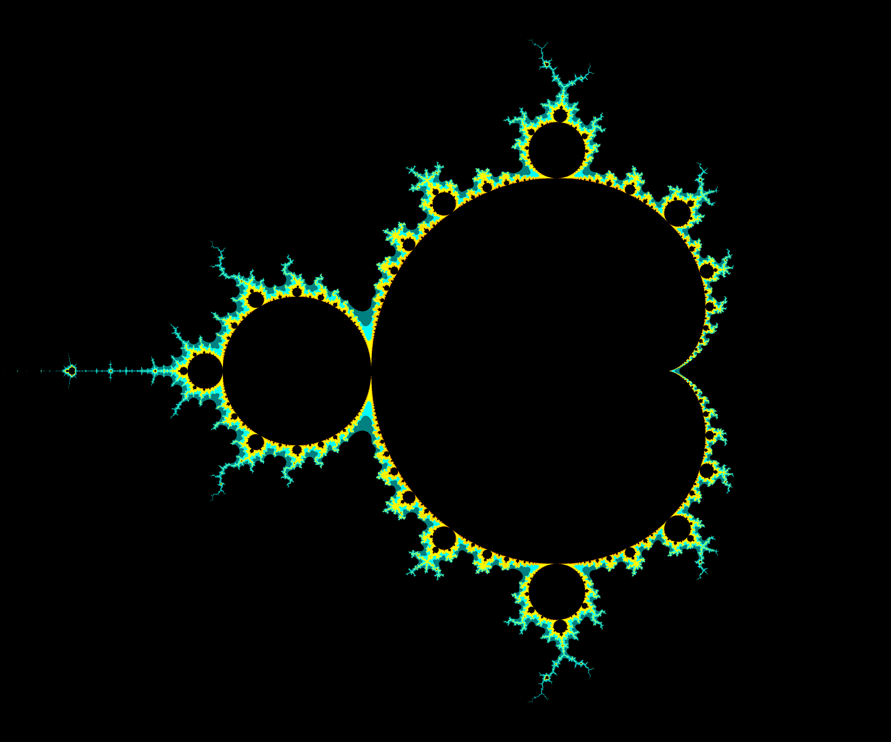

# Mandelbrot set Image Generator

A small program that generates a portion of the [Mandelbrot set](https://en.wikipedia.org/wiki/Mandelbrot_set).

Uses [ImageMagick](https://imagemagick.org/) to make the image, specifically its C++ API (Magick++). Also [enkiTS](https://github.com/dougbinks/enkiTS) to efficiently distribute the workload between threads.

If you don't have access to the Magick++ headers, there is a version that generates a text file for ImageMagick to read instead, on the `legacy` branch. It's really slow though.

## Prerequisites

You need to have ImageMagick installed on your system, and the Magick++ headers. Ubuntu: `sudo apt install imagemagick libmagick++-dev`

`graphicsmagick-libmagick-dev-compat` will also work, however it is approximately the same speed (possibly a tiny bit slower) as `libmagick++-dev`. [GraphicsMagick](http://www.graphicsmagick.org/) is faster than ImageMagick for normal stuff, but here ImageMagick is only used to directly copy pixels to the image. If you prefer GraphicsMagick, you need to change `MAGICK_FLAGS` in the Makefile to `-lMagick++`.

## Building (Linux)

Just run `make`. **IMPORTANT:** If you're using ImageMagick 7, you must remove `-DUSE_IM6` from the Makefile!!! Ubuntu is still on ImageMagick 6 so that's the default. [Most distros have moved on though.](https://repology.org/project/imagemagick/versions)

* If you compiled ImageMagick from source, you'll probably have to change `MAGICK_FLAGS` in the Makefile to have the include directory and link the Magick++ library, because `pkg-config` might not be able to find it.
* If you are using Clang but encounter `/usr/bin/ld: cannot find -lomp: No such file or directory`, you're missing the OpenMP development package: `sudo apt install libomp-dev`. Clang was noticeably slower in my testing, so I recommend GCC.
* By default, the image is constrained to 8-bit color depth. (ImageMagick seems to automatically lower the bit depth if it's safe to do so.) If you want to use the default bitdepth your version of ImageMagick was compiled with, add `-DAUTO_BITDEPTH` to the Makefile. If you want something custom, manually edit the line. This change was made to produce smaller filesizes while typically looking identical.
* `-march=native` is enabled by default. Remove it from the Makefile if you don't want it.
* There are some `#define`s available to slightly tune the core loop if you so desire: `MANDELBROT_ITER_SMALL_VAL` determines how long to do precise iterations, and `MANDELBROT_ITER_INCR` determines how many iterations to do at once after that (to take advantage of CPUs' long pipelines before jumping back to the start of the loop). Changing these will result in an identical image, so don't worry about playing around.
* Optionally, you can increase float precision used when calculating: change `typedef float c_float;` to `typedef double c_float;`.

By default, `-ffast-math` is enabled because the images produced look extremely similar. However, the results are "incorrect" because of this. If it's enough to bother you, remove it from the Makefile.

## Running

`./mandelbrot.out <num_threads> <x_start> <x_end> <y_start> <y_end> <image_width> <image_height> <output_name> [<optional coloring file>]`

`x_start`, `x_end`, `y_start`, and `y_end` are the bounds on the Mandelbrot set that will be used in the image.

Included in this repository is the result of running `./mandelbrot.out <irrelevant> -2 2 -2 2 1000 1000 example1.png`, `./mandelbrot.out <irrelevant> -2 1 -1.25 1.25 3000 2500 example2.png`, and `./mandelbrot.out <irrelevant> -.65 -.45 .4 .6 2000 2000 example3.png` (see below), without `-ffast-math`.

Change the colors by editing the constants "near" the top of `main.cpp`, or by passing in a coloring file (see syntax below).

In my testing I discovered BMP images to be the fastest to make and AVIF to be the slowest. PNG tends to have smaller filesizes than JPG and WEBP for large blocks of colors, such as the default coloring provided.





## Building (Windows)

Only MSVC x64 is officially supported. Set your environment variables with `"C:\Program Files\Microsoft Visual Studio\2022\Community\VC\Auxiliary\Build\vcvars64.bat"`, run `build_win64.bat` to build, `"Debug/mandelbrot.exe"` to run. Note that the instruction set is SSE2 (the default) because MSVC does not have the equivalent of `-march=native`, so you should add the relevant [`/arch`](https://learn.microsoft.com/en-us/cpp/build/reference/arch-minimum-cpu-architecture) for your CPU if you want extra performance. **IMPORTANT:** You will probably have to change the ImageMagick version. It's currently set to `ImageMagick-7.1.2-Q16-HDRI`, which is the current version and recommended setup as of writing. If you are using ImageMagick 6 (why), add `/DUSE_IM6`. If you want to use ImageMagick's default bitdepth instead of 8-bit, add `/DAUTO_BITDEPTH`.

`/fp:fast` in theory *should* be okay to add, as float precision is not really an issue, however it started producing some really wrong results for me. Maybe an MSVC update changed it, or maybe the wrong-looking result is the flag actually working. Feel free to experiment.

## Optional Coloring File

The formatting is very simple: every line contains an integer for the iteration count followed by three floats (in range 0.0-1.0) for the color. The iteration count must go from smallest to largest for correct functionality.

```
<iteration> R G B
<iteration> R G B
<iteration> R G B
...
```

Example:

```
2 0.0 0.0 0.0
5 1.0 0.0 0.0
35 0.5 0.5 1.0
10000 1 1 1
```


# Performance Results

This program has gone through several iterations for more performance. Note that all performance results will vary greatly depending on the Mandelbrot location, threads used, and CPU (and even RAM if your image is just too big).

## Text file

The first version was very primitive: multithreaded calculate the Mandelbrot set, store the pixels in a huge grid, convert each pixel to a line of text, and dump that for ImageMagick to read. Maybe you're surprised ImageMagick could even make an image from a text file, but anyway it was really slow: >50% of the time was converting the text to an image.

Using more threads would decrease the calculating time, but it couldn't do anything about ImageMagick. If only there was a way to directly access its API in C++, that would be so much faster...

## Magick++

And it sure was faster! Now ImageMagick only takes ~15%\* of the total time. (I would later learn the colors were wrong though...) Of course I already knew about Magick++ long before this project's first commit, however I didn't know how to get access to the headers without compiling from source myself. Eventually I learned of the `libmagick++-dev` package, and then I felt silly for not knowing about it sooner.

\* Except I wasn't using `libmagick++-dev` when getting that result, but `graphicsmagick-libmagick-dev-compat`, which is ~5x faster! (GraphicsMagick is a speed-focused fork of ImageMagick.) So the true performance gains were a lot less, but I didn't know that at the time.

Now that the bottleneck was the calculation (or perceived to be), I had to look for a better solution. Because I was lazy and just wanted a minimum viable product, the text file version simply split the image into slices and assigned each thread to a slice. The threads that finished sooner would simply stop, not helping the threads still working. Writing a whole producer-consumer queue would have been the obvious solution, but if only there was an even easier solution...

## [enkiTS](https://github.com/dougbinks/enkiTS) thread manager

Someone else had already written a much better library than I could've come up with, and it was extremely easy to add. Now that the threads were far more efficiently utilized, the computation part ran ~2x faster! I don't think enkiTS allows threads to steal work from each other, but that's okay for this use case.

I also added `-march=native` to the Makefile and switched from `-O2` to `-O3` for a smidgen of extra performace. Not a big difference, but free performance is free performance.

## Color accuracy rewrite

It was at this point I coincidentally realized the image produced by Magick++ had incorrect colors. Also finally realized I had been using GraphicsMagick, but that's unrelated, as both were giving incorrect colors either way.

I guessed (and later confirmed) it was because of the float values getting cast at the wrong time and/or integer division instead of float division. However, there were four separate versions of the program in one file (text file, Magick++, enkiTS, Magick++ & enkiTS) and it was too much to maintain. The text file version is basically an embarrassment, and no need to keep the simple thread manager, so that all got deleted; check out the `legacy` branch if you want to see the code. I changed the pixels to store floats, and the colors were correct, using `Magick::ColorRGB` to skip any casts... however, this required *a lot* more RAM (a 30000×25000 image took 90GB; I'm glad RAM is realtively cheap nowadays), and it was all allocated up-front. Furthermore, the performance of Magick++ was very noticeable now that I switched to ImageMagick.

All this time, Magick++ was editing a single pixel at a time. After calculating every pixel's color, it would modify the image's pixels one-by-one. I'm no expert on ImageMagick inner workings, but I believe there's some kind of synchronization after every write, so you can probably guess this method is very inefficient. If only there was some way to directly access the pixel buffer, synchronizing just a single time...

## Magick++ "batched" pixel copying

And there is. At first I didn't want to because the API changed between ImageMagick 6 and 7, and unfortunately Ubuntu still lags behind, so that would mean writing two separate code paths... except the API is almost identical, crisis averted! Finally the performance of Magick++ is reasonable, taking significantly less time than before (except for *extremely* large or low-compute images, as ImageMagick itself has limited multithreading capabilities when writing the image, then it's possible ImageMagick will be slower than the calculation).

From here, there are no obvious areas left to improve performance. The most noticeable area would have to be in ImageMagick, as its poor multithreading sure is noticeable on *extremely* large images. However, you really shouldn't be making very large images, because *most programs refuse to load them*; I had use a photo editor just to view them in their full resolution. Still, I can't help but think about improving the compute performance. Surely there's at least one thing left to take advantage of in modern architectures, right? If only there was— oh you get the point by now...

## Minor pipeline improvement

So there is one small area left to improve performance, namely the iteration count calculation. Most pixel iteration counts are *probably* either very small or very large, so instead of doing only one iteration at a time for the high values, do more for better performance. I've rewritten this section several times because I don't know how to properly explain the theory, so I hope this explanation is good enough to get the point across:

Modern CPUs have long instruction pipelines, so every loop has to wait a long time to check its conditional, thus more compute per loop is free performance. This optimization was inspired by [loop unrolling](https://en.wikipedia.org/wiki/Loop_unrolling), however compiling with `-fno-unroll-loops` resulted in nearly identical performance on GCC—though Clang saw a rather drastic drop, probably because it's really aggressive at loop unrolling—suggesting it wasn't an issue with filling the pipeline but instead the branch itself being very expensive. Branches are still one of the most expensive instruction in a CPU, despite modern >99% accurate [TAGE](https://inria.hal.science/hal-03408381/document)-based predictors, because wrong predictions force a pipeline flush.

TL;DR: Put more compute in loop to run the loop less to get better performance. Got ~25% improvement.

There are new defines added: `MANDELBROT_ITER_SMALL_VAL` for the initial precise counting, and `MANDELBROT_ITER_INCR` for how many iterations to run at once after that. If it overshoots, it will wind back and do precise iteration to give an identical image as before. If you really want, you could get slightly better performance by removing the "wind back" feature, however the image will be *slightly* different.

From here, I really don't think there are any easy gains left. I tried adding [rpmalloc](https://github.com/mjansson/rpmalloc) just to see if it could give a little boost, but this program is execution-bound, not memory allocation-bound, so it didn't. I also tried running [Tracy](https://github.com/wolfpld/tracy) and [GPROF](https://en.wikipedia.org/wiki/Gprof), but they didn't reveal anything useful. At best, a library for SIMD instructions (or C++26's `<simd>`) could be smarter than what the compiler normally generates, but otherwise I'll call this as optimized as it can be.

# License

MIT

[enkiTS](https://github.com/dougbinks/enkiTS) license: zlib

# Acknowledgments

* [Numberphile](https://www.youtube.com/@numberphile/videos)
* the person I saw that did something very similar to this, but they printed colors in the terminal, and I wanted to do better by using ImageMagick
